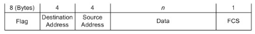

# Лабораторная работа №2

## Написать программу для пакетной передачи данных через COM-порты, с поддержкой бит-стаффинга, в соответствии с требованиями ниже.

Требования к наполнению программы:
1. Взять за основу программу, относящуюся к лабораторной работе №1.
2. Модифицировать систему ввода. Кроме Enter, допускать ввод только символов '0' и '1' (условные биты).
3. Реализовать структуру пакета -- в данном случае кадра, показанную на рисунке.

Длина поля данных должна быть фиксированной и равной n байтам, где n -- номер по списку группы. В качестве флага использовать двоичное представление 128 + n. В поле Source Address записывать номер используемого COM-порта. Поля Destination Address и FCS предусмотреть, но передавать нулевыми.
4. Реализовать один из алгоритмов бит-стаффинга (по своему усмотрению).

Требования к интерфейсу программы:
1. Модифицировать окно состояния. В дополнение к количеству переданных байтов периодически выводить структуру текущего кадра перед передачей (после байт-стаффинга). Один кадр должен соответствовать одной строке. При этом выделять (любым способом) биты (байты), модифицированные в результате бит-стаффинга.

## Used stack

- Linux OS
- PyQt 6
- tty0tty emulator (https://github.com/freemed/tty0tty)